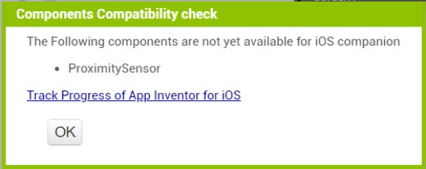
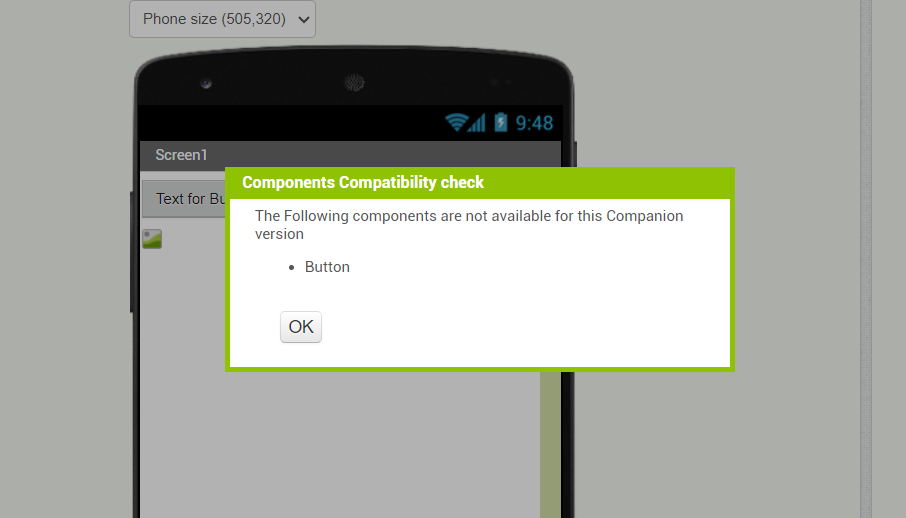

# About me
- **Name:** Aditya B N
- **Email:** adirn26@gmail.com
- **Github:** https://github.com/adirn26
- **LinkedIn:** https://www.linkedin.com/in/aditya-b-n-7a39b459
- **Location:** Bengaluru, India
- **Timezone:** Asia/Kolkata (UTC +05:30)

## Project Details
- **Project Name:** Dynamic notification of whether a component is implemented in iOS
- **Organization:** [MIT App Inventor](https://github.com/mit-cml)
- **Mentor:** [Evan W. Patton](https://github.com/ewpatton)
- **Project Proposal Link:** [GSoC Project Proposal](https://docs.google.com/document/d/1oFaH2ULEED19wcx4171plxiXtfctRgV0-FU4EkjEIz8/edit?usp=sharing)
- **Project Pull Requests:** 
    - [Dynamic notification of whether a component is implemented in iOS (GSOC 2023)](https://github.com/mit-cml/appinventor-sources/pull/2901)
    - [Companion version component availability](https://github.com/mit-cml/appinventor-sources/pull/2956)
    - [Adding-palette-filter-dropdown](https://github.com/ewpatton/appinventor-sources/pull/15)

## Project Abstract
This project aims to enhance the user experience by providing information about component availability in iOS or android within the designer. Not all components have been implemented in iOS, making it difficult for users to know which components are available in iOS. To address this issue, the project proposes changes to the Designer editor to specify whether the component is available in iOS or android. By providing this information, we can enhance the usability of the iOS companion and help users make informed decisions when designing their apps.

## How can this help the MIT App Inventor Users?
Displaying component availability information in the MIT App Inventor designer would improve the user experience by making it easier to determine which components are available in iOS or Android. Then, the users would be able to design and develop their apps more efficiently and make more informed decisions. This would result in higher-quality apps that meet the needs and expectations of users.

## Work Summary

- **Dropdown Menu:** Added a Dropdown menu in the components palette to filter the components based on the platform (iOS/Android) they are available in.  

- **Incompatibility Dialog:** When the user connects their device through the companion app, a dialog appears only if their project includes components unsupported on the device's platform (Android or iOS). This dialog lists incompatible components, then ends the connection. For iOS, it includes a hyperlink to track App Inventor for iOS progress.  
The dialog box iOS Devices would appear as follows:

- **Palette Indicators:** Palette items display text indicating Android/iOS availability. Help popup shows 'Only Android Compatible' or 'Only iOS Compatible' for single-platform components.

- **Unsupported Components Display:** Added a new functionality to display the components that are unsupported in particular AI Companion versions, when user connects their device through the AI Companion. 

## TODO [For Future Work]
- **Dropdown Consistency:** Integrating dropdown functionality to the singleton palette object implmentation for it to remain consistent across all the screens.
- **Webrtc Connection States:** Enhancing webrtc connection states for Companion version component availability check by adding anew state for the **simple_components.json** transfer.

## Acknowledgements

I extend my heartfelt gratitude to [Evan W. Patton](https://github.com/ewpatton) for his invaluable guidance and mentorship throughout this transformative journey. Additionally, I'd like to express my appreciation to  [Susan Rati Lane](https://github.com/SusanRatiLane) for her unwavering support. It is my sincere hope that this project will contribute to making MIT App Inventor more accessible and user-friendly for everyone. 

## 