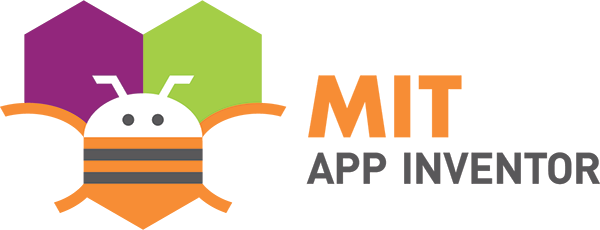
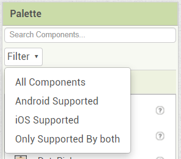
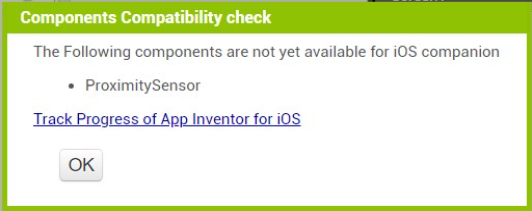
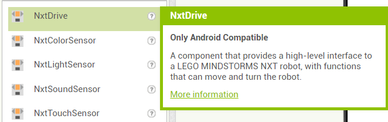
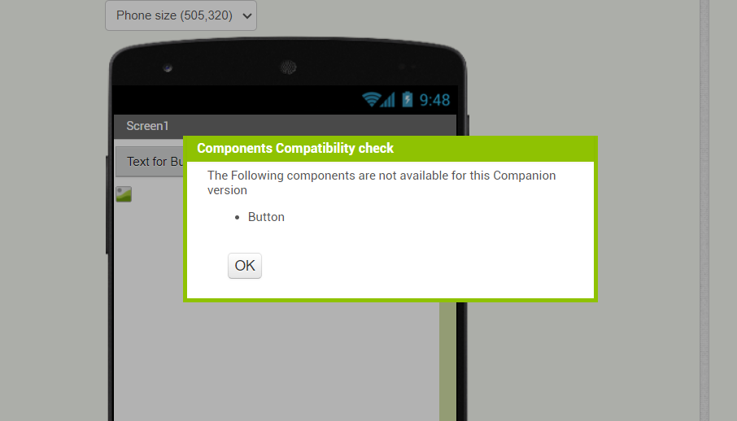

<h1>Final Submission for GSoC 2023</h1>

# About me
- **Name:** Aditya B N
- **Email:** [adirn26@gmail.com](adirn26@gmail.com)
- **Github:** [https://github.com/adirn26](https://github.com/adirn26)
- **LinkedIn:** [https://www.linkedin.com/in/aditya-b-n-7a39b459](https://www.linkedin.com/in/aditya-b-n-7a39b459)
- **Location:** Bengaluru, India
- **Timezone:** Asia/Kolkata (UTC +05:30)

## Project Details
- **Project Name:** Dynamic notification of whether a component is implemented in iOS
- **Organization:** [MIT App Inventor](https://github.com/mit-cml)
- **Mentor:** [Evan W. Patton](https://github.com/ewpatton)
- **Project Proposal Link:** [GSoC Project Proposal](https://docs.google.com/document/d/1oFaH2ULEED19wcx4171plxiXtfctRgV0-FU4EkjEIz8/edit?usp=sharing)
- **Project Pull Requests:** 
    - [Dynamic notification of whether a component is implemented in iOS (GSOC 2023)](https://github.com/mit-cml/appinventor-sources/pull/2901)
    - [Companion version component availability](https://github.com/mit-cml/appinventor-sources/pull/2956)
    - [Adding-palette-filter-dropdown](https://github.com/ewpatton/appinventor-sources/pull/15)

## Project Abstract
This project aims to enhance the user experience by providing information about component availability in iOS or android within the designer. Not all components have been implemented in iOS, making it difficult for users to know which components are available in iOS. To address this issue, the project proposes changes to the Designer editor to specify whether the component is available in iOS or android. By providing this information, we can enhance the usability of the iOS companion and help users make informed decisions when designing their apps.

## How can this help the MIT App Inventor Users?
Displaying component availability information in the MIT App Inventor designer would improve the user experience by making it easier to determine which components are available in iOS or Android. Then, the users would be able to design and develop their apps more efficiently and make more informed decisions. This would result in higher-quality apps that meet the needs and expectations of users.

## Work Summary

- **Dropdown Menu:** Implemented a dropdown menu in the components palette to filter components based on their platform availability (iOS/Android).    

- **Incompatibility Dialog:** Added a dialog that appears when a user connects their device through the companion app and their project contains unsupported components for the device's platform (iOS/Android). The dialog lists incompatible components and terminates the connection if necessary. For iOS, a hyperlink was included to track App Inventor for iOS progress.  
The dialog box for iOS Devices would appear as follows:    

- **Palette Indicators:** Enhanced the palette items to display text indicating whether a component is available on Android or iOS. The help popup provides additional information such as 'Only Android Compatible' or 'Only iOS Compatible' for single-platform components.   

- **Unsupported Components Display:** Implemented a new functionality to display components that are unsupported in specific AI Companion versions. This is shown when a user connects their device through the AI Companion.
  

## TODO [For Future Work]
- **Dropdown Consistency:**  Integrate dropdown functionality with the singleton palette object implementation to maintain consistency across all screens.
- **Webrtc Connection States:** Enhance the WebRTC connection states for checking component availability in different companion versions by adding a new state for the **simple_components.json** transfer.

## Acknowledgements

I extend my heartfelt gratitude to [Evan W. Patton](https://github.com/ewpatton) for his invaluable guidance and mentorship throughout this transformative journey. Additionally, I'd like to express my appreciation to  [Susan Rati Lane](https://github.com/SusanRatiLane) for her unwavering support. It is my sincere hope that this project will contribute to making MIT App Inventor more accessible and user-friendly for everyone. 

## My GSoC Experience: Learnings and Growth
Participating in Google Summer of Code has been a transformative journey. Through this experience, I've not only honed my technical skills but also gained valuable insights into the world of open-source development. Collaborating with my mentors and the vibrant MIT App Inventor community has taught me the significance of effective communication, the art of problem-solving, and the beauty of teamwork. I've had the privilege of learning new technologies, navigating challenges, and refining my coding practices. GSoC has not only enriched my knowledge but has also empowered me with a sense of accomplishment, as I've contributed to a project that impacts users worldwide. This journey of personal growth and skill enhancement is something I'll carry forward in my future endeavors.
